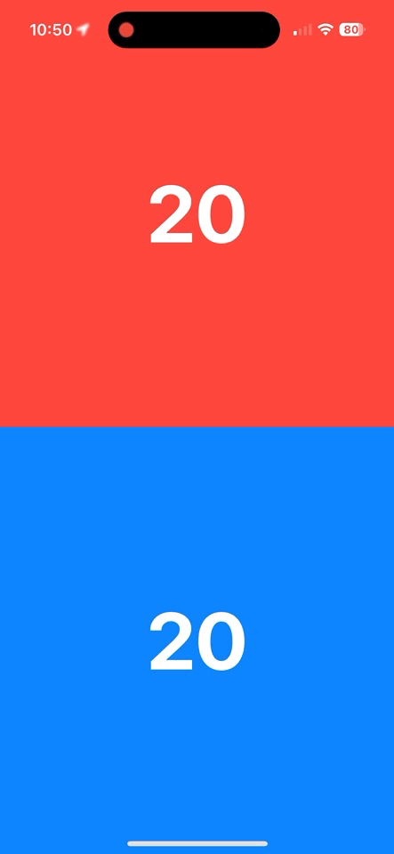

# MTG Life Counter

## About
Track the scores of 2-4 players in a game of Magic the Gathering if you don't have any D20s. My friend asked if I could make this for him since we both like MTG, and I figured this would be relatively simple to make with SwiftUI; indeed it was. If you like this app or found it useful, I would appreciate if you starred it or even shared it with your friends. I also don't expect to work on this too much more, as I am quite satisfied with the end result.

## Usage
The default number of players is two, but long pressing on the top and/or bottom section unhides the another players. Everyone starts with 20 health. Swipe up to increase health by one, and down to decrease by one. Once a player hits zero, there will be an alert asking to restart or not. Doing so resets everyone's health back to 20. But the coolest feature by far is the ability to rotate each player's score so that you can simply place the device on a table or playing surface, and everyone can read their own scores. The swipe directions also update with the rotation, so whatever is "up" always increases score and "down" decreases. To rotate, tap the score itself.

## Installation
1. Clone this repository or download it as a zip folder and uncompress it.
2. Open up the `.xcodeproj` file, which should automatically launch Xcode.
3. You might need to change the signing of the app from the current one.
4. Click the `Run` button near the top left of Xcode to build and install.

#### Prerequisites
Hopefully this goes without saying, but you need Xcode, which is only available on Macs.

#### Notes
You can run this app on the Xcode simulator or connect a physical device.  
The device must be either an iPhone or iPad running iOS 17.0 or newer.  

## SDKs
* [SwiftUI](https://developer.apple.com/xcode/swiftui/) - Helps you build great-looking apps across all Apple platforms.

## Bugs
If you find one, feel free to open up a new issue or even better, create a pull request fixing it. 

#### Resolved
- [x] If a player hits zero, and then presses `cancel` in the restart dialogue, any subsequent swipes will also invoke the dialogue. Fixed by storing an array of players who have lost and skipping them in the check for other player who have hit zero.
- [x] If a player keeps on trying to decrease their score below zero, it will take that many swipes to bring it back up, even though the text would still say `0`. Fixed by simply not allowing that.

## Change Log
* v1.0 - initial release
* v1.1 - more player support
* v1.2 - restart bug fix
* v1.3 - negative score fix
* v1.4 - support iOS 18 icons

## Contributors
Sachin Agrawal: I'm a self-taught programmer who knows many languages and I'm into app, game, and web development. For more information, check out my website or Github profile. If you would like to contact me, my email is [github@sachin.email](mailto:github@sachin.email).

## License
This package is licensed under the [MIT License](LICENSE.txt).
